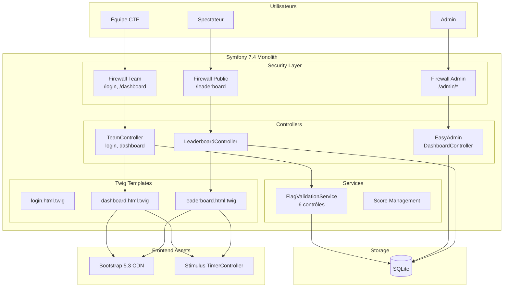

# 2. High Level Architecture

## 2.1 Technical Summary

**CTF Tracker** adopte une architecture **monolithique MVC classique** basée sur Symfony 7.4. L'application combine backend PHP et frontend Twig dans un déploiement unique, avec SQLite comme base de données embarquée. Cette architecture privilégie la **simplicité opérationnelle** et la **rapidité de développement** pour un événement ponctuel supportant ~10 équipes simultanées.

Les patterns clés incluent : Repository Pattern pour l'accès aux données, Services pour la logique métier (notamment `FlagValidationService`), et une authentification multi-firewall (Admin/Team). L'interactivité frontend minimale est gérée par Stimulus (timer countdown).

## 2.2 High Level Overview

| Aspect | Choix | Rationale |
|--------|-------|-----------|
| **Style architectural** | Monolithe MVC | Simplicité, équipe réduite, événement ponctuel |
| **Repository structure** | Monorepo | Application unique, pas de séparation frontend/backend |
| **Service architecture** | Monolith Symfony | Un seul déploiement, zéro coordination inter-services |
| **User interaction** | SSR + JS minimal | Twig génère le HTML, Stimulus pour le timer |
| **Data flow** | Synchrone | Score calculé et persisté immédiatement |

**Décisions architecturales clés :**
1. **SQLite** plutôt que MySQL/PostgreSQL → Fichier unique, zéro configuration serveur DB
2. **Sessions Symfony** plutôt que JWT → Simplicité, pas d'API stateless nécessaire
3. **EasyAdmin** plutôt que admin custom → CRUD automatique, gain de temps majeur
4. **Score dénormalisé** sur Team → Performance leaderboard, pas de calcul à la volée

## 2.3 High Level Project Diagram

## 2.4 Architectural Patterns

| Pattern | Description | Rationale |
|---------|-------------|-----------|
| **MVC** | Séparation Entities/Controllers/Twig | Standard Symfony |
| **Repository Pattern** | Abstraction accès données | Testabilité, requêtes réutilisables |
| **Service Layer** | Logique métier dans `src/Service/` | Isolation FlagValidationService |
| **Form Type Pattern** | Validation via Symfony Forms | Sécurité CSRF intégrée |
| **Multi-Firewall Auth** | 2 firewalls séparés | Isolation admin/team |
| **Denormalized Score** | Score stocké sur Team | Performance O(1) leaderboard |

---
