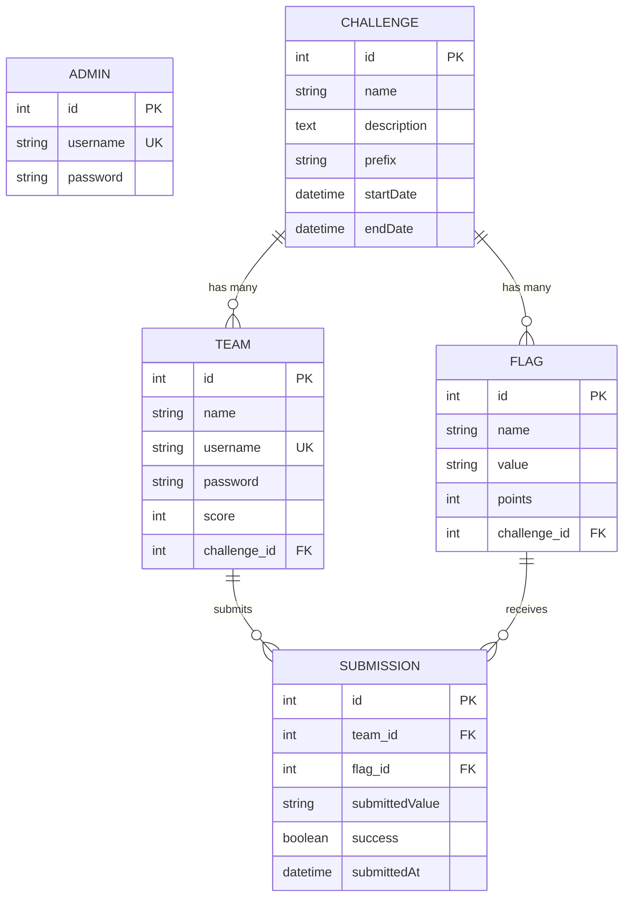

# 4. Data Models

## 4.1 Entity Relationship Diagram



## 4.2 Admin

| Attribut | Type | Contraintes | Description |
|----------|------|-------------|-------------|
| `id` | integer | PK, auto-increment | Identifiant unique |
| `username` | string(180) | unique, not null | Identifiant connexion |
| `password` | string(255) | not null | Hash bcrypt/argon2 |

**Rôle Symfony:** `ROLE_ADMIN`

## 4.3 Challenge

| Attribut | Type | Contraintes | Description |
|----------|------|-------------|-------------|
| `id` | integer | PK, auto-increment | Identifiant unique |
| `name` | string(255) | not null | Nom du challenge |
| `description` | text | nullable | Description affichée |
| `prefix` | string(50) | not null, default "FLAG" | Préfixe des flags |
| `startDate` | DateTimeImmutable | not null | Début du challenge |
| `endDate` | DateTimeImmutable | not null | Fin du challenge |

**Méthodes métier:**
```php
public function isActive(): bool
public function isUpcoming(): bool
public function isEnded(): bool
```

## 4.4 Flag

| Attribut | Type | Contraintes | Description |
|----------|------|-------------|-------------|
| `id` | integer | PK, auto-increment | Identifiant unique |
| `name` | string(255) | not null | Label du flag |
| `value` | string(255) | not null | Valeur secrète (sans préfixe) |
| `points` | integer | not null, default 0 | Points attribués |
| `challenge_id` | integer | FK, not null | Challenge parent |

**Index:** `idx_flag_challenge_value` sur `(challenge_id, value)`

## 4.5 Team

| Attribut | Type | Contraintes | Description |
|----------|------|-------------|-------------|
| `id` | integer | PK, auto-increment | Identifiant unique |
| `name` | string(255) | not null | Nom affiché (leaderboard) |
| `username` | string(180) | unique, not null | Identifiant connexion |
| `password` | string(255) | not null | Hash mot de passe |
| `score` | integer | not null, default 0 | Score dénormalisé |
| `challenge_id` | integer | FK, not null | Challenge associé |

**Rôle Symfony:** `ROLE_TEAM`

**Index:** `idx_team_challenge` sur `(challenge_id)`

## 4.6 Submission

| Attribut | Type | Contraintes | Description |
|----------|------|-------------|-------------|
| `id` | integer | PK, auto-increment | Identifiant unique |
| `team_id` | integer | FK, not null | Équipe soumettant |
| `flag_id` | integer | FK, not null | Flag ciblé |
| `submittedValue` | string(255) | not null | Valeur soumise (audit) |
| `success` | boolean | not null | Résultat validation |
| `submittedAt` | DateTimeImmutable | not null, auto | Timestamp |

**Index:** `idx_submission_team_flag_success` sur `(team_id, flag_id, success)`

---
