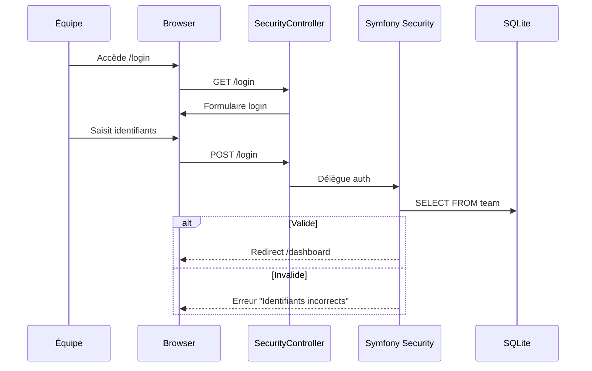
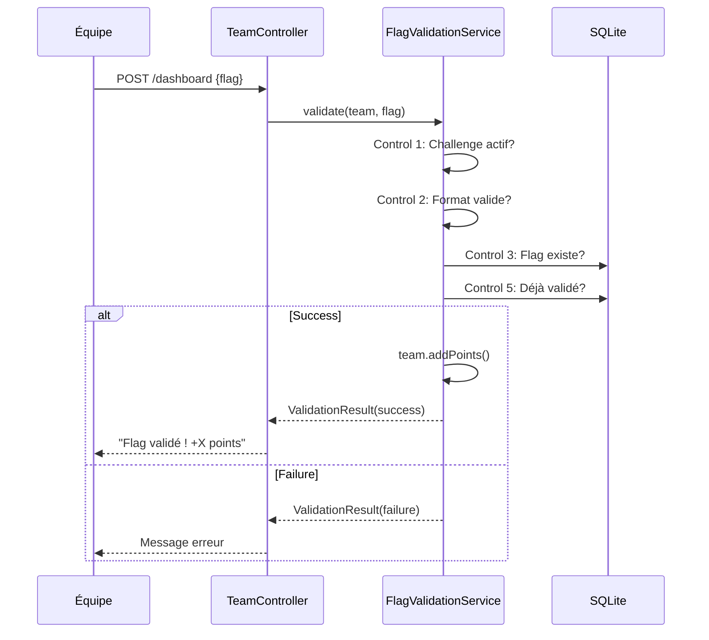
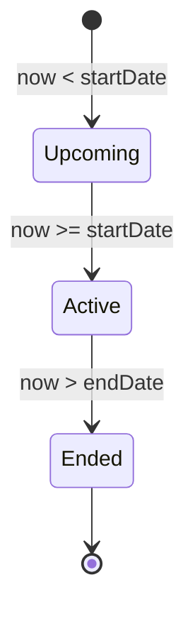

# 7. Core Workflows

## 7.1 Connexion Équipe

```mermaid
sequenceDiagram
    participant U as Équipe
    participant B as Browser
    participant C as SecurityController
    participant S as Symfony Security
    participant DB as SQLite

    U->>B: Accède /login
    B->>C: GET /login
    C->>B: Formulaire login
    U->>B: Saisit identifiants
    B->>C: POST /login
    C->>S: Délègue auth
    S->>DB: SELECT FROM team

    alt Valide
        S-->>B: Redirect /dashboard
    else Invalide
        S-->>B: Erreur "Identifiants incorrects"
    end
```

## 7.2 Soumission de Flag

```mermaid
sequenceDiagram
    participant U as Équipe
    participant TC as TeamController
    participant FVS as FlagValidationService
    participant DB as SQLite

    U->>TC: POST /dashboard {flag}
    TC->>FVS: validate(team, flag)

    FVS->>FVS: Control 1: Challenge actif?
    FVS->>FVS: Control 2: Format valide?
    FVS->>DB: Control 3: Flag existe?
    FVS->>DB: Control 5: Déjà validé?

    alt Success
        FVS->>FVS: team.addPoints()
        FVS-->>TC: ValidationResult(success)
        TC-->>U: "Flag validé ! +X points"
    else Failure
        FVS-->>TC: ValidationResult(failure)
        TC-->>U: Message erreur
    end
```

## 7.3 États Challenge

```mermaid
stateDiagram-v2
    [*] --> Upcoming: now < startDate
    Upcoming --> Active: now >= startDate
    Active --> Ended: now > endDate
    Ended --> [*]
```

---
