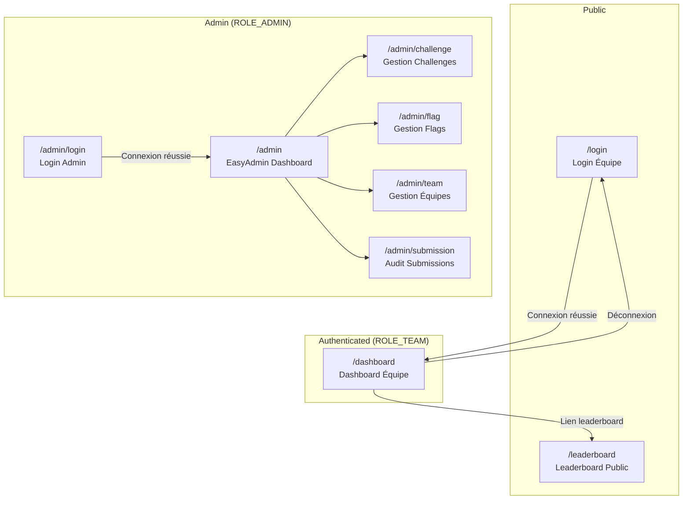
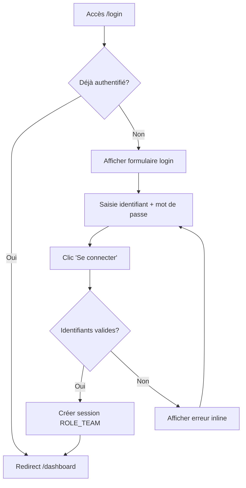
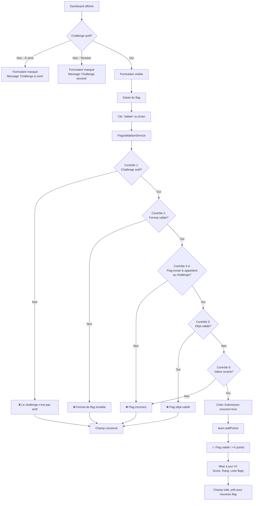
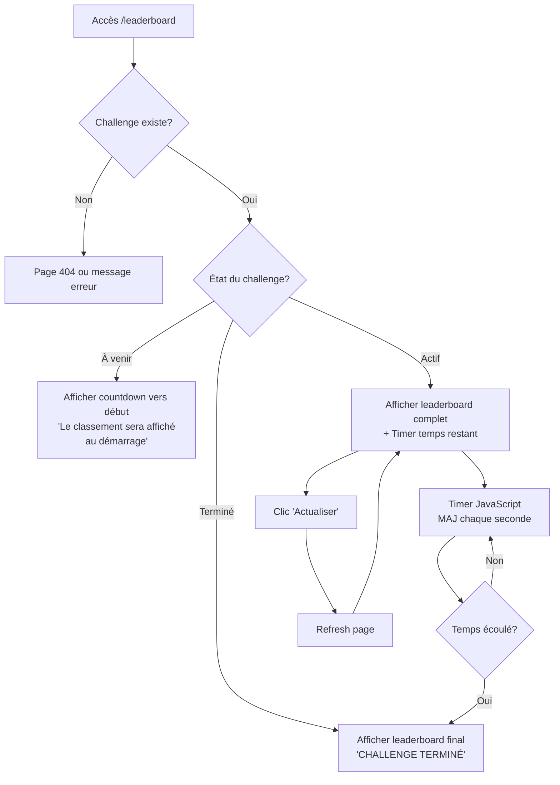

# CTF Tracker UI/UX Specification

**Version:** 1.0
**Date:** 2026-01-09
**Author:** Sally (UX Expert)
**Status:** Complete

---

## Table of Contents

1. [Introduction](#1-introduction)
2. [Information Architecture](#2-information-architecture)
3. [User Flows](#3-user-flows)
4. [Wireframes & Mockups](#4-wireframes--mockups)
5. [Component Library](#5-component-library)
6. [Branding & Style Guide](#6-branding--style-guide)
7. [Accessibility Requirements](#7-accessibility-requirements)
8. [Responsiveness Strategy](#8-responsiveness-strategy)
9. [Animation & Micro-interactions](#9-animation--micro-interactions)
10. [Performance Considerations](#10-performance-considerations)
11. [Next Steps](#11-next-steps)

---

## 1. Introduction

This document defines the user experience goals, information architecture, user flows, and visual design specifications for **CTF Tracker**'s user interface. It serves as the foundation for visual design and frontend development, ensuring a cohesive and user-centered experience.

### 1.1 Target User Personas

| Persona | Description |
|---------|-------------|
| **Équipe CTF** | Étudiants en cybersécurité participant au hackathon. Objectif : soumettre des flags rapidement, suivre leur progression, comparer leur rang. Niveau technique : intermédiaire à avancé. Contexte : stress de compétition, temps limité. |
| **Spectateur/Enseignant** | Observateurs non-authentifiés qui consultent le leaderboard projeté. Besoin : visibilité immédiate du classement et du temps restant. |
| **Administrateur** | Organisateur gérant les challenges, flags et équipes via EasyAdmin. _(Interface EasyAdmin standard — hors périmètre design custom)_ |

### 1.2 Usability Goals

- **Efficacité immédiate** : Une équipe doit pouvoir soumettre un flag en moins de 5 secondes après connexion
- **Clarté du feedback** : Succès ou erreur compris instantanément (couleurs + icônes + texte)
- **Visibilité du contexte** : Score, rang et temps restant toujours visibles sans scroll
- **Projection-friendly** : Leaderboard lisible à distance sur grand écran

### 1.3 Design Principles

1. **Simplicité radicale** — Inspiration PicoCTF : chaque écran = une action principale, zéro distraction
2. **Feedback inline immédiat** — Messages de succès/erreur directement sous le champ concerné
3. **Dashboard-centric** — Toutes les infos équipe sur un seul écran (pas de navigation superflue)
4. **Accessibilité pragmatique** — WCAG AA, contraste suffisant pour projection, focus visible

### 1.4 Change Log

| Date | Version | Description | Author |
|------|---------|-------------|--------|
| 2026-01-09 | 1.0 | Création initiale | Sally (UX Expert) |

---

## 2. Information Architecture (IA)

### 2.1 Site Map / Screen Inventory



### 2.2 Navigation Structure

**Primary Navigation (Équipe)**

| Élément | Route | Visible si |
|---------|-------|------------|
| Logo/Titre | — | Toujours (non-cliquable) |
| Timer | — | Toujours (header) |
| Déconnexion | `/logout` | Authentifié |

> **Note :** Pas de menu de navigation classique. L'interface équipe est mono-écran (Dashboard). Le seul lien externe est vers le Leaderboard.

**Secondary Navigation**

- **Dashboard** : Lien "Voir le leaderboard" → `/leaderboard`
- **Leaderboard** : Bouton "Actualiser" (refresh page)

**Breadcrumb Strategy**

> Non applicable — L'architecture est plate (3 écrans indépendants). Aucun breadcrumb nécessaire.

---

## 3. User Flows

### 3.1 Flow : Connexion Équipe

**User Goal:** Se connecter pour accéder au dashboard et soumettre des flags

**Entry Points:**
- URL directe `/login`
- Redirection automatique depuis `/dashboard` si non authentifié

**Success Criteria:** L'équipe arrive sur le Dashboard avec son score et rang visibles



**Edge Cases & Error Handling:**
- **Identifiants incorrects** : Message "❌ Identifiants incorrects" sous le formulaire, champs conservés
- **Challenge non actif** : Connexion autorisée, mais dashboard affiche état approprié (à venir / terminé)
- **Session expirée** : Redirection vers login avec message implicite

---

### 3.2 Flow : Soumission de Flag (Flow Principal)

**User Goal:** Soumettre un flag capturé et gagner des points

**Entry Points:** Dashboard (`/dashboard`) — formulaire toujours visible

**Success Criteria:** Points ajoutés au score, flag apparaît dans la liste des validés, feedback positif affiché



**Edge Cases & Error Handling:**
- **Format invalide** (ex: "flag123" sans accolades) : "❌ Format de flag invalide" — champ conservé
- **Flag incorrect** : "❌ Flag incorrect" — message volontairement vague (sécurité)
- **Double soumission** : "❌ Flag déjà validé" — évite la confusion
- **Soumission pendant transition état** : Le contrôle 1 (challenge actif) protège ce cas

**Notes:**
- Toutes les soumissions (succès ET échecs) sont enregistrées en base pour audit
- La comparaison est **case-sensitive** (exact match)

---

### 3.3 Flow : Consultation Leaderboard

**User Goal:** Voir le classement en temps réel (équipe ou spectateur)

**Entry Points:**
- URL directe `/leaderboard` (public)
- Lien depuis Dashboard "Voir le leaderboard"

**Success Criteria:** Classement visible avec timer, actualisable manuellement



**Edge Cases & Error Handling:**
- **Aucune équipe inscrite** : Message "Aucune équipe inscrite pour le moment"
- **Égalité de score** : Les équipes partagent le même rang (ex: deux #3)
- **Timer atteint zéro** : Affichage automatique "TERMINÉ" (JavaScript)

---

## 4. Wireframes & Mockups

**Primary Design Files:** `docs/wireframes.md` (wireframes low-fidelity ASCII)

> **Note :** Aucun outil de design externe (Figma, Sketch) n'est utilisé pour ce MVP. Les wireframes ASCII servent de référence directe pour l'implémentation Twig.

### 4.1 Écran : Login Équipe (`/login`)

**Purpose:** Permettre aux équipes de s'authentifier pour accéder au dashboard

**Key Elements:**
- Logo/Titre "🏴 CTF TRACKER" centré
- Sous-titre dynamique (nom du challenge)
- Champ "Identifiant" (input text)
- Champ "Mot de passe" (input password)
- Bouton "Se connecter" (primary)
- Zone de feedback erreur (inline, sous le formulaire)

**Interaction Notes:**
- Formulaire centré verticalement et horizontalement
- Soumission via Enter ou clic bouton
- Focus initial sur le champ identifiant
- Erreur affichée inline avec icône ❌

**Design File Reference:** `docs/wireframes.md#e1--login-équipe`

---

### 4.2 Écran : Dashboard Équipe (`/dashboard`)

**Purpose:** Vue principale équipe — soumission de flags et suivi de progression

**Key Elements:**
- **Header sticky** : Logo + Timer (HH:MM:SS) + Bouton déconnexion
- **Card Score** : Score total en gros (ex: "450 pts")
- **Card Rang** : Position classement (ex: "#3")
- **Card Soumission** : Formulaire flag avec hint format + feedback inline
- **Card Flags Validés** : Liste des flags capturés avec points
- **Lien Leaderboard** : Bouton secondaire vers `/leaderboard`

**Interaction Notes:**
- Header reste visible au scroll (sticky)
- Timer mis à jour chaque seconde (JS)
- Feedback soumission apparaît sous le champ input
- Score/Rang se mettent à jour après validation réussie

**Design File Reference:** `docs/wireframes.md#e2--dashboard-équipe`

---

### 4.3 Écran : Leaderboard Public (`/leaderboard`)

**Purpose:** Classement public projetable sur grand écran

**Key Elements:**
- **Titre challenge** : Centré, prominent (ex: "🏆 HACKATHON RED TEAM 2026 🏆")
- **Timer** : Countdown centré avec label "temps restant"
- **Liste équipes** : Rang + Nom + Score, médailles pour top 3
- **Footer** : Nombre de flags disponibles + bouton Actualiser

**Interaction Notes:**
- Optimisé pour projection (gros texte, contraste élevé)
- Timer JavaScript (pas de polling serveur)
- Refresh manuel uniquement (bouton)
- Médailles emoji : 🥇 🥈 🥉

**Design File Reference:** `docs/wireframes.md#e3--leaderboard-public`

---

## 5. Component Library / Design System

**Design System Approach:** Bootstrap 5.3

> L'application utilise Bootstrap 5.3 comme framework CSS. Cela permet de bénéficier de composants éprouvés, d'une grille responsive native, et de réduire le temps de développement frontend.

**Installation (CDN) :**
```html
<link href="https://cdn.jsdelivr.net/npm/bootstrap@5.3.3/dist/css/bootstrap.min.css" rel="stylesheet">
<script src="https://cdn.jsdelivr.net/npm/bootstrap@5.3.3/dist/js/bootstrap.bundle.min.js"></script>
```

---

### 5.1 Card

**Bootstrap Component:** `card`

| Variant CTF | Classes Bootstrap |
|-------------|-------------------|
| Card standard | `card` |
| Card primary (soumission) | `card border-primary` |
| Card compact (score/rang) | `card text-center` |

```html
<div class="card">
  <div class="card-body">
    <h5 class="card-title">VOTRE SCORE</h5>
    <p class="card-text display-4 fw-bold font-monospace">450 pts</p>
  </div>
</div>
```

---

### 5.2 Button

**Bootstrap Component:** `btn`

| Variant CTF | Classes Bootstrap |
|-------------|-------------------|
| Primary (Se connecter, Valider) | `btn btn-primary` |
| Secondary (Voir leaderboard) | `btn btn-outline-secondary` |
| Danger (Déconnexion) | `btn btn-outline-danger btn-sm` |

```html
<button type="submit" class="btn btn-primary">Se connecter</button>
<a href="/leaderboard" class="btn btn-outline-secondary">🏆 Voir le leaderboard</a>
```

---

### 5.3 Input / Form

**Bootstrap Component:** `form-control`, `form-label`, `form-text`

| Variant CTF | Classes Bootstrap |
|-------------|-------------------|
| Input text/password | `form-control` |
| Label | `form-label` |
| Hint text | `form-text` |
| Input error | `form-control is-invalid` + `invalid-feedback` |
| Input success | `form-control is-valid` + `valid-feedback` |

```html
<div class="mb-3">
  <label for="flag" class="form-label">Soumettez votre flag</label>
  <input type="text" class="form-control" id="flag" aria-describedby="flagHint">
  <div id="flagHint" class="form-text">Format attendu : FLAG{...}</div>
</div>
```

---

### 5.4 Feedback Message / Alert

**Bootstrap Component:** `alert`, `invalid-feedback`, `valid-feedback`

| Variant CTF | Classes Bootstrap |
|-------------|-------------------|
| Success (Flag validé) | `alert alert-success` ou `valid-feedback` |
| Error (Flag incorrect) | `alert alert-danger` ou `invalid-feedback` |
| Info | `alert alert-info` |
| Warning (Challenge à venir) | `alert alert-warning` |

```html
<div class="alert alert-success" role="alert">
  ✅ Flag validé ! +100 points
</div>
```

---

### 5.5 Timer

**Implementation:** Badge Bootstrap + JavaScript custom

```html
<!-- Timer header -->
<span class="badge bg-dark fs-6 font-monospace">⏱️ 02:34:15</span>

<!-- Timer prominent (leaderboard) -->
<div class="text-center my-4">
  <span class="display-4 font-monospace">⏱️ 02:34:15</span>
  <p class="text-muted">temps restant</p>
</div>

<!-- Timer terminé -->
<span class="badge bg-danger fs-5 font-monospace">⏱️ TERMINÉ</span>
```

---

### 5.6 Leaderboard

**Bootstrap Component:** `table` (recommandé pour accessibilité)

```html
<table class="table table-striped table-hover">
  <thead>
    <tr>
      <th scope="col">#</th>
      <th scope="col">Équipe</th>
      <th scope="col" class="text-end">Score</th>
    </tr>
  </thead>
  <tbody>
    <tr>
      <td>🥇</td>
      <td>Les Hackers</td>
      <td class="text-end font-monospace">1,250 pts</td>
    </tr>
    <tr>
      <td>🥈</td>
      <td>Cyber Squad</td>
      <td class="text-end font-monospace">1,100 pts</td>
    </tr>
  </tbody>
</table>
```

---

### 5.7 Header / Navbar

**Bootstrap Component:** `navbar`

```html
<nav class="navbar navbar-light bg-light sticky-top">
  <div class="container">
    <span class="navbar-brand">🏴 CTF TRACKER</span>
    <span class="badge bg-dark fs-6 font-monospace" id="timer">⏱️ 02:34:15</span>
    <a href="/logout" class="btn btn-outline-danger btn-sm">Déconnexion</a>
  </div>
</nav>
```

---

### 5.8 Layout Grid

**Dashboard :**
```html
<div class="container py-4">
  <div class="row g-4">
    <div class="col-md-6"><div class="card text-center"><!-- Score --></div></div>
    <div class="col-md-6"><div class="card text-center"><!-- Rang --></div></div>
    <div class="col-12"><div class="card border-primary"><!-- Form --></div></div>
    <div class="col-12"><div class="card"><!-- Flags validés --></div></div>
  </div>
</div>
```

**Login (centré) :**
```html
<div class="container">
  <div class="row justify-content-center align-items-center min-vh-100">
    <div class="col-md-4">
      <div class="card"><!-- Login form --></div>
    </div>
  </div>
</div>
```

---

### 5.9 Customisation Bootstrap

```css
:root {
  --bs-primary: #2563eb;
  --bs-success: #16a34a;
  --bs-danger: #dc2626;
  --bs-warning: #ca8a04;
  --bs-font-monospace: ui-monospace, "SF Mono", Menlo, Monaco, monospace;
}
```

---

## 6. Branding & Style Guide

### 6.1 Visual Identity

- **Style général** : Minimaliste, light theme, inspiration PicoCTF
- **Ambiance** : Technique mais accessible, compétitif mais fun (emojis)
- **Logo** : Texte "🏴 CTF TRACKER" (emoji + typographie, pas d'image)

---

### 6.2 Color Palette

| Color Type | Hex Code | CSS Variable | Usage |
|------------|----------|--------------|-------|
| **Primary** | `#2563eb` | `--color-primary` | Boutons principaux, liens, accents |
| **Primary Hover** | `#1d4ed8` | `--color-primary-hover` | État hover des boutons primary |
| **Success** | `#16a34a` | `--color-success` | Flag validé, confirmations |
| **Warning** | `#ca8a04` | `--color-warning` | Alertes, challenge à venir |
| **Error** | `#dc2626` | `--color-error` | Erreurs, challenge terminé |
| **Text Primary** | `#1f2937` | `--color-text` | Texte principal |
| **Text Secondary** | `#6b7280` | `--color-text-muted` | Labels, hints, texte secondaire |
| **Background** | `#ffffff` | `--color-bg` | Fond principal |
| **Background Alt** | `#f3f4f6` | `--color-bg-alt` | Fond cards, sections alternées |
| **Border** | `#e5e7eb` | `--color-border` | Bordures cards, inputs |

> **Note Projection** : Ces couleurs offrent un contraste suffisant pour projection sur fond clair.

---

### 6.3 Typography

#### Font Families

| Type | Font | Fallback | Usage |
|------|------|----------|-------|
| **Primary** | `system-ui` | `-apple-system, "Segoe UI", Roboto, sans-serif` | Tout le texte UI |
| **Monospace** | `ui-monospace` | `"SF Mono", Menlo, Monaco, monospace` | Timer, flags, scores |

#### Type Scale

| Element | Size | Weight | Line Height | Usage |
|---------|------|--------|-------------|-------|
| **H1** | `2rem` (32px) | 700 | 1.2 | Titre leaderboard |
| **H2** | `1.5rem` (24px) | 600 | 1.3 | Titres cards |
| **H3** | `1.25rem` (20px) | 600 | 1.4 | Sous-titres |
| **Body** | `1rem` (16px) | 400 | 1.5 | Texte courant |
| **Small** | `0.875rem` (14px) | 400 | 1.4 | Hints, labels secondaires |
| **Score** | `2.5rem` (40px) | 700 | 1 | Score dans card (monospace) |
| **Timer** | `1.5rem` (24px) | 600 | 1 | Countdown (monospace) |

---

### 6.4 Iconography

**Icon Library:** Emojis natifs Unicode

| Icon | Emoji | Usage |
|------|-------|-------|
| Flag/Logo | 🏴 | Header, branding |
| Trophy | 🏆 | Leaderboard, victoire |
| Gold Medal | 🥇 | 1ère place |
| Silver Medal | 🥈 | 2ème place |
| Bronze Medal | 🥉 | 3ème place |
| Timer | ⏱️ | Countdown |
| Hourglass | ⏳ | Challenge à venir |
| Checkmark | ✅ / ✓ | Succès, flag validé |
| Cross | ❌ | Erreur |
| Flag (CTF) | 🚩 | Nombre de flags |

**Usage Guidelines:**
- Emojis pour simplicité (pas de SVG/icon font à charger)
- Toujours accompagnés de texte (accessibilité)
- Taille proportionnelle au texte adjacent

---

### 6.5 Spacing & Layout

**Grid System:** CSS Grid / Flexbox simple (pas de framework grid)

**Spacing Scale (base 4px):**

| Token | Value | Usage |
|-------|-------|-------|
| `--space-1` | 4px | Micro-espacements |
| `--space-2` | 8px | Entre éléments proches |
| `--space-3` | 12px | Padding inputs |
| `--space-4` | 16px | Padding cards, gaps |
| `--space-6` | 24px | Sections majeures |
| `--space-8` | 32px | Entre cards |

**Layout Principles:**
- Max-width conteneur : `800px` (centré)
- Padding page : `16px` (mobile) / `24px` (desktop)
- Gap entre cards : `16px` (mobile) / `24px` (desktop)

---

## 7. Accessibility Requirements

**Compliance Target:** WCAG 2.1 Level AA

> Bootstrap 5.3 intègre de bonnes pratiques d'accessibilité (focus states, ARIA). Cette section complète avec les spécificités CTF Tracker.

### 7.1 Key Requirements

#### Visual

| Requirement | Specification | Bootstrap Support |
|-------------|---------------|-------------------|
| **Color Contrast** | 4.5:1 (normal), 3:1 (large) | ✅ Thème par défaut conforme |
| **Focus Indicators** | Outline visible | ✅ Natif Bootstrap |
| **Text Sizing** | Base 16px, rem units | ✅ Natif Bootstrap |
| **Color Independence** | Icônes + texte | À implémenter (emojis + texte) |

#### Interaction

| Requirement | Specification | Bootstrap Support |
|-------------|---------------|-------------------|
| **Keyboard Navigation** | Tab order logique | ✅ Natif |
| **Touch Targets** | Min 44x44px | ✅ `btn` classes |
| **Enter/Space Activation** | Boutons activables | ✅ Natif `<button>` |

#### Content

| Requirement | Specification | Implementation |
|-------------|---------------|----------------|
| **Form Labels** | `<label>` explicites | `form-label` Bootstrap |
| **Error Messages** | Liés aux champs | `invalid-feedback` + `aria-describedby` |
| **Heading Structure** | H1 → H2 → H3 | Un H1 par page |
| **Language** | Déclarée | `<html lang="fr">` |

---

### 7.2 Bootstrap Accessibility Features

```html
<!-- Formulaire avec validation Bootstrap -->
<div class="mb-3">
  <label for="flag" class="form-label">Soumettez votre flag</label>
  <input type="text" class="form-control is-invalid" id="flag" aria-describedby="flagFeedback" required>
  <div id="flagFeedback" class="invalid-feedback">❌ Flag incorrect</div>
</div>

<!-- Alert accessible -->
<div class="alert alert-success" role="alert">✅ Flag validé ! +100 points</div>

<!-- Timer (non-live pour éviter spam vocal) -->
<span class="badge bg-dark" role="timer" aria-label="Temps restant: 2 heures 34 minutes">⏱️ 02:34:15</span>
```

---

### 7.3 Testing Strategy

| Method | Tool | Frequency |
|--------|------|-----------|
| Automated Scan | Lighthouse / axe | Avant release |
| Keyboard Test | Manuel | Tous les parcours |
| Screen Reader | VoiceOver / NVDA | Parcours critique |

**Checklist pré-release :**
- [ ] Lighthouse Accessibility ≥ 90
- [ ] Navigation Tab complète sans blocage
- [ ] Labels sur tous les inputs
- [ ] Focus visible partout

---

## 8. Responsiveness Strategy

Bootstrap 5.3 gère nativement le responsive via son système de grille.

### 8.1 Breakpoints

| Breakpoint | Bootstrap Class | Min Width | Target Devices |
|------------|-----------------|-----------|----------------|
| **Mobile** | (default) | 0 | Smartphones portrait |
| **Small** | `sm` | 576px | Smartphones paysage |
| **Medium** | `md` | 768px | Tablettes |
| **Large** | `lg` | 992px | Desktop, laptops |
| **X-Large** | `xl` | 1200px | Grands écrans, projection |

---

### 8.2 Adaptation Patterns

#### Layout Changes

| Screen | Mobile (< 768px) | Desktop (≥ 768px) |
|--------|------------------|-------------------|
| **Login** | Card pleine largeur | Card centrée, max-width 400px |
| **Dashboard** | Cards empilées (1 col) | Score/Rang côte à côte (2 col) |
| **Leaderboard** | Table scrollable | Table pleine largeur |

#### Content Priority (Mobile First)

1. **Timer** — Toujours visible
2. **Score/Rang** — Visible sans scroll
3. **Formulaire soumission** — Accessible rapidement
4. **Flags validés** — Scroll si nécessaire

---

### 8.3 Bootstrap Implementation

```html
<!-- Dashboard: Score/Rang responsive -->
<div class="row g-3">
  <div class="col-12 col-md-6">
    <div class="card text-center"><!-- Score --></div>
  </div>
  <div class="col-12 col-md-6">
    <div class="card text-center"><!-- Rang --></div>
  </div>
</div>

<!-- Header responsive -->
<nav class="navbar navbar-light bg-light sticky-top">
  <div class="container">
    <span class="navbar-brand">
      🏴 <span class="d-none d-sm-inline">CTF TRACKER</span>
    </span>
    <span class="badge bg-dark fs-6 font-monospace">⏱️ 02:34:15</span>
    <a href="/logout" class="btn btn-outline-danger btn-sm">
      <span class="d-none d-md-inline">Déconnexion</span>
      <span class="d-md-none">✕</span>
    </a>
  </div>
</nav>

<!-- Leaderboard table responsive -->
<div class="table-responsive">
  <table class="table table-striped"><!-- ... --></table>
</div>
```

---

### 8.4 Projection Mode (Leaderboard)

**Recommandations :**
- Mode plein écran navigateur (F11)
- Résolution : 1920x1080
- Classes Bootstrap `display-*` pour texte agrandi
- `fs-4` ou `fs-3` sur les lignes du tableau

---

## 9. Animation & Micro-interactions

Approche minimaliste : animations légères pour le feedback, performance et accessibilité prioritaires.

### 9.1 Motion Principles

1. **Subtilité** — Animations courtes, jamais distrayantes
2. **Feedback** — Confirmer visuellement les actions
3. **Performance** — CSS uniquement, pas de librairie JS
4. **Accessibilité** — Respecter `prefers-reduced-motion`

---

### 9.2 Key Animations

| Animation | Élément | Duration | Trigger |
|-----------|---------|----------|---------|
| **Fade In** | Feedback message | 200ms | Après soumission |
| **Button Hover** | Boutons | 150ms | Hover |
| **Score Update** | Card score | 300ms | Flag validé |
| **Timer Pulse** | Timer | 1s | < 60 secondes |
| **Timer Shake** | Timer | 300ms | Challenge terminé |

---

### 9.3 CSS Implementation

```css
/* Respect reduced motion */
@media (prefers-reduced-motion: reduce) {
  *, *::before, *::after {
    animation-duration: 0.01ms !important;
    transition-duration: 0.01ms !important;
  }
}

/* Feedback fade in */
.feedback-animate {
  animation: fadeIn 200ms ease-out;
}
@keyframes fadeIn {
  from { opacity: 0; transform: translateY(-4px); }
  to { opacity: 1; transform: translateY(0); }
}

/* Score highlight */
.score-updated {
  animation: highlight 300ms ease-out;
}
@keyframes highlight {
  0% { background-color: var(--bs-success); color: white; }
  100% { background-color: transparent; }
}

/* Timer urgent pulse */
.timer-urgent { animation: pulse 1s ease-in-out infinite; }
@keyframes pulse {
  0%, 100% { opacity: 1; }
  50% { opacity: 0.7; }
}
```

---

### 9.4 Timer JavaScript

```javascript
function updateTimer(endTime) {
  const timer = document.getElementById('timer');
  const remaining = endTime - Date.now();

  if (remaining <= 0) {
    timer.textContent = '⏱️ TERMINÉ';
    timer.classList.add('bg-danger');
    return;
  }

  if (remaining <= 60000) {
    timer.classList.add('timer-urgent', 'bg-warning');
  }

  const h = Math.floor(remaining / 3600000);
  const m = Math.floor((remaining % 3600000) / 60000);
  const s = Math.floor((remaining % 60000) / 1000);
  timer.textContent = `⏱️ ${String(h).padStart(2,'0')}:${String(m).padStart(2,'0')}:${String(s).padStart(2,'0')}`;
}

setInterval(() => updateTimer(challengeEndTime), 1000);
```

---

## 10. Performance Considerations

### 10.1 Performance Goals

| Metric | Target |
|--------|--------|
| **First Contentful Paint** | < 1.5s |
| **Time to Interactive** | < 2s |
| **Interaction Response** | < 100ms |
| **Bundle Size (CSS)** | < 50KB gzip |
| **Bundle Size (JS)** | < 30KB gzip |

---

### 10.2 Design Strategies

| Strategy | Implementation |
|----------|----------------|
| **CDN Bootstrap** | jsdelivr CDN (cache partagé) |
| **Fonts système** | Pas de Google Fonts |
| **Emojis natifs** | Pas d'icon font |
| **Pas d'images** | Logo texte, icônes emoji |
| **JS minimal** | Vanilla JS, timer uniquement |
| **SSR Twig** | HTML complet côté serveur |
| **Pas de polling** | Timer client-side |
| **Refresh manuel** | Leaderboard sur demande |

---

### 10.3 Lighthouse Targets

| Category | Target |
|----------|--------|
| **Performance** | ≥ 90 |
| **Accessibility** | ≥ 90 |
| **Best Practices** | ≥ 90 |

---

### 10.4 Checklist

- [ ] Bootstrap CDN avec `integrity` hash
- [ ] Script timer en `defer`
- [ ] Lighthouse Performance ≥ 90
- [ ] Test connexion 3G simulée

---

## 11. Next Steps

### 11.1 Immediate Actions

1. **Review avec stakeholders** — Valider cette spec avec l'équipe projet
2. **Handoff Architecture** — Transmettre au Design Architect pour implémentation
3. **Créer les templates Twig** — Implémenter les 3 écrans (Login, Dashboard, Leaderboard)
4. **Intégrer Bootstrap 5.3** — Configurer le layout de base Symfony
5. **Implémenter le timer JS** — Script countdown autonome

---

### 11.2 Design Handoff Checklist

- [x] User flows documented
- [x] Component inventory complete (Bootstrap 5.3)
- [x] Accessibility requirements defined (WCAG AA)
- [x] Responsive strategy clear
- [x] Color palette / Typography defined
- [x] Animation specs provided
- [x] Performance goals established

---

### 11.3 Documents de référence

| Document | Path |
|----------|------|
| PRD | `docs/prd.md` |
| Wireframes | `docs/wireframes.md` |
| Architecture | `docs/architecture.md` |
| Front-End Spec | `docs/front-end-spec.md` |

---

### 11.4 Open Questions (Post-MVP)

| Question | Priority |
|----------|----------|
| Auto-refresh leaderboard (WebSocket/SSE) ? | Low |
| Mode sombre ? | Low |
| Export scores JSON ? | Low |

---

### 11.5 Prompt pour l'Architecte

> Utilise cette spécification UI/UX (`docs/front-end-spec.md`) et l'architecture technique existante pour créer les templates Twig. Le design system est basé sur **Bootstrap 5.3 via CDN**. Les 3 écrans à implémenter sont : Login (`/login`), Dashboard (`/dashboard`), et Leaderboard (`/leaderboard`). Le timer JavaScript est décrit en section 9.4.

---

*Document généré avec BMAD-METHOD™ — UX Expert Sally*
